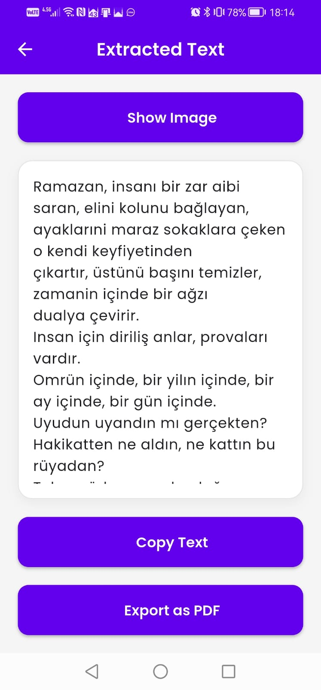
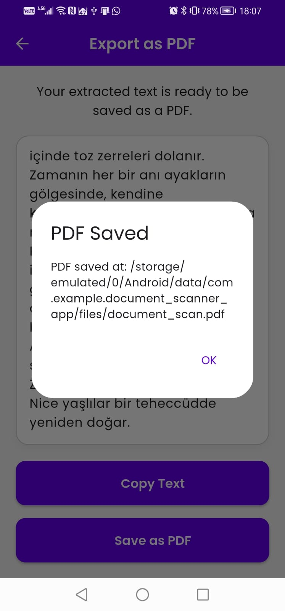

# Document Scanner App 📄

A modern, powerful document scanning application built with Flutter. It allows users to scan documents using the camera or gallery, extract text using OCR, and export the results as PDF files. Designed with a premium UI, smooth animations, and dark mode support.

## ✨ Features

-   **Smart Scanning**: Capture documents using the camera or pick images from the gallery.
-   **Text Recognition (OCR)**: Instantly extract text from images using Google ML Kit.
-   **PDF Export**: Convert extracted text into professional PDF documents.
-   **Dynamic UI**:
    -   **Dark/Light Mode**: Fully customizable theme with a modern color palette (Deep Indigo & Teal).
    -   **Interactive Elements**: Animated buttons and transitions for a smooth user experience.
-   **Clipboard Support**: Easily copy extracted text to the clipboard.
-   **Privacy Focused**: All processing happens on-device.

## 🛠️ Tech Stack

-   **Framework**: [Flutter](https://flutter.dev/)
-   **State Management**: [Provider](https://pub.dev/packages/provider)
-   **OCR**: [Google ML Kit](https://pub.dev/packages/google_ml_kit)
-   **PDF Generation**: [pdf](https://pub.dev/packages/pdf)
-   **Image Picker**: [image_picker](https://pub.dev/packages/image_picker)
-   **Storage**: [Shared Preferences](https://pub.dev/packages/shared_preferences) (for saving theme settings)
-   **Animations**: [Flutter Animate](https://pub.dev/packages/flutter_animate)
-   **Typography**: [Google Fonts](https://pub.dev/packages/google_fonts)

## 🚀 Getting Started

### Prerequisites

-   Flutter SDK installed (version 3.0.0 or higher)
-   Dart SDK installed

### Installation

1.  **Clone the repository**:
    ```bash
    git clone https://github.com/yourusername/document_scanner_app.git
    cd document_scanner_app
    ```

2.  **Install dependencies**:
    ```bash
    flutter pub get
    ```

3.  **Run the app**:
    ```bash
    flutter run
    ```

## 📱 Screenshots

| Home Screen | Dark Mode | Text Recognition | PDF Export |
|:---:|:---:|:---:|
|  |  |  | 

*(Note: Add your screenshots to an `assets/screenshots` folder)*

## 🤝 Contributing

Contributions are welcome! Please feel free to submit a Pull Request.

## 📄 License

This project is licensed under the MIT License - see the [LICENSE](LICENSE) file for details.
